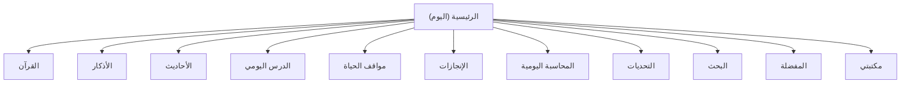

# تطبيق «أثر» — Technical Specification (Flutter)

> النسخة دي معدّة عشان تتدي مباشرة لـ AI coding agent (Gemini جوه Antigravity مثلاً) ينفذها. الرؤية والمحتوى الأصلي محفوظين زي ما هما، والإضافة هنا هي الطبقة التقنية اللي كانت ناقصة عشان الـ agent ميرتجلش قرارات معمارية، ولا — الأخطر — يرتجل محتوى ديني.

---

## 🔴 قاعدة رقم صفر — حطها في أول أي prompt هتديه للـ agent

**ممنوع نهائيًا** إن أي AI agent يولّد أو "يكمّل من الذاكرة" أي نص آية، حديث، أو ذكر. أي محتوى ديني في التطبيق لازم يكون منسوخ حرفيًا من المصادر المحددة في القسم 3. الموديلات بتحاول أحيانًا "تساعد" وتكمل نص حديث ناقص من عندها لو مش لاقية المصدر جاهز — وده أخطر باج ممكن يحصل في المشروع ده، لأنه ممكن ينتج حديث موضوع أو تفسير غلط بثقة كاملة. اعتبرها constraint صريح مش ملاحظة عابرة.

---

## إيه اللي اتغيّر عن النسخة الأصلية

- ✅ Tech stack محدد بالاسم (مش "SQLite" عام) — state management, navigation, packages
- ✅ مصادر محتوى حقيقية وموجودة فعلاً (بدل قائمة أسماء كتب من غير ما نعرف نجيبها منين) — تفاصيل كاملة تحت
- ✅ Data schema بالحقول الكاملة، مش بس أسماء جداول
- ✅ ضفت جدول `sunan` (سنة اليوم) اللي كان ناقص من هيكل البيانات الأصلي رغم إنه واحد من الخمس بطاقات الرئيسية
- ✅ خريطة شاشات وnavigation routes
- ✅ نظام تصميم فعلي (ألوان/خطوط/dark mode) مش بس "هادئة ومريحة"
- ✅ خطة مراحل (Phase 1/2/3) بدل ما تدي الـ agent الـ 12 ميزة في برومبت واحد
- ✅ Guardrails صريحة للـ agent، خصوصًا حول دقة المحتوى الديني
- ✅ ملاحظات performance / offline-testing / RTL

---

## 1. الرؤية والمبادئ (كما هي، مختصرة)

تطبيق إسلامي أوفلاين بالكامل، شعاره **«تعلم... اعمل... واستمر»**. هدفه يجاوب على "أعمل إيه النهاردة؟" مش "أقرأ إيه؟". النجاح بيتقاس بعدد الأعمال اللي التطبيق ساعد عليها، مش عدد الصفحات المقروءة.

خمس مبادئ أي قرار تقني لازم يحترمها:

1. **Offline 100%** — صفر network calls وقت التشغيل العادي.
2. **بدون تسجيل دخول وبدون حساب.**
3. **بدون إعلانات وبدون أي SDK تتبّع/analytics.**
4. **خفيف وسريع** — يشتغل كويس على أجهزة متوسطة الفئة (السوق المصري في الأغلب Android متوسط).
5. **خصوصية كاملة** — كل بيانات المستخدم (محاسبة، تقدّم، مفضلة) على الجهاز فقط.

---

## 2. Tech Stack

| الطبقة | الاختيار | السبب |
|---|---|---|
| Framework | Flutter (stable channel) + Dart | ... |
| State Management | **Riverpod** | تعامل بسيط مع reactive state، مهم لتحديث streaks/progress لحظيًا، وسهل في الاختبار. لو الفريق مرتاح أكتر مع **Bloc** (بيتماشى مع خلفية Clean Architecture) ده اختيار بديل سليم برضه — القرار مش نهائي، بس لازم يتاخد قبل أي سطر كود. |
| Local DB | **Drift** (طبقة type-safe فوق sqflite) | بيدّيك reactive streams مباشرة للـ UI — مثالي لشاشة الإنجازات و"مكتبتي" اللي المفروض تتحدث تلقائيًا. البديل الأخف: `sqflite` مباشرة لو عايزين تبسيط. |
| Navigation | `go_router` | declarative routing، وسهل لو حبيت لاحقًا تفتح آية معينة من إشعار (deep link). |
| Local Notifications | `flutter_local_notifications` | لتذكير "المحاسبة قبل النوم" و"مهمة اليوم" — مش مذكورة صراحة في الخطة الأصلية بس منطقية جدًا هنا؛ **حطيتها كإضافة واضحة عشان تراجعها**. |
| خط الواجهة | Cairo أو Tajawal (Google Fonts) | خط عربي حديث وواضح، مجاني |
| خط القرآن | خط عثماني مخصص — تفاصيل قسم 6 | لازم يكون مختلف عن خط الواجهة |

### هيكل المجلدات (feature-first)

```
lib/
  core/
    database/          # Drift setup + seeding logic (تحميل المحتوى من المصادر لأول مرة)
    theme/
    widgets/            # shared widgets
    utils/
  features/
    home/
    quran/
    azkar/
    hadith/
    lessons/
    life_situations/
    achievements/
    muhasaba/
    challenges/
    search/
    favorites/
    library/
    settings/
  main.dart
```

---

## 3. مصادر المحتوى المعتمدة (أهم قسم في الملف كله)

كل صف هنا نتيجة بحث فعلي، مش تخمين. لازم تتحط في أي prompt للـ agent بدون اختصار.

| المحتوى | المصدر الموصى بيه | ملاحظات دمج |
|---|---|---|
| نص القرآن (رسم عثماني) | package **`quran_flutter`** على pub.dev — نص من مشروع Tanzil.net، يشتغل أوفلاين بالكامل، فيه بيانات السور/الأجزاء/الصفحات جاهزة. للمرحلة الأكثر premium لاحقًا: **`qcf_quran_plus`** أو **`quran_library`** (مبنيين على خط KFGQPC الرسمي، نفس تخطيط صفحات المصحف المدني + تلوين تجويد) | Phase 1: `quran_flutter` عشان تشتغل بسرعة وبثقة. Phase 3: تقييم الترقية لخط QCF لو عايز شكل المصحف الحقيقي بصفحاته |
| التفسير الميسر | GitHub: **`Quran-Tafseer/tafseer_api`** (tafseer_id = 1، مصدره Tanzil.net برضه) | JSON بينزل مرة واحدة، seed script يملى جدول `tafsir` وقت أول تشغيل — **متجيبش الثمن تفاسير التانية**، بس الميسر، عشان يفضل خفيف |
| الأحاديث (بخاري، مسلم، الأربعون النووية، رياض الصالحين) | GitHub: **`AhmedBaset/hadith-json`** — قاعدة JSON شاملة عربي/إنجليزي، فيها بالظبط نفس الكتب الأربعة المطلوبة + غيرها | **متسحبش كل الـ 50 ألف حديث.** انتقِ فقط اللي يخص التصنيفات التسعة (قسم 4)، والاختيار ده لازم مراجعة بشرية منك مش قرار agent وحده |
| الأذكار (حصن المسلم) | GitHub: **`rn0x/hisn_almuslim_json`** أو **`rn0x/Adhkar-json`** | نفس منطق الـ seed script |
| الأدعية | نفس مصدر حصن المسلم، بس في جدول منفصل مع حقل "متى يقال" | ... |

**قبل أي إصدار:** راجع عينة عشوائية (30-50 عنصر) يدويًا مقابل مصدر معتمد زي sunnah.com، وتأكد من ترخيص كل مصدر (أغلبها MIT للكود، لكن بعض الخطوط زي QCF ليها شروط attribution منفصلة عن الكود).

---

## 4. Data Model (SQLite / Drift Schema)

```sql
-- ========== محتوى مرجعي: بيتزرع مرة واحدة من المصادر أعلاه ==========

CREATE TABLE tafsir (
  id INTEGER PRIMARY KEY,
  surah_number INTEGER NOT NULL,
  ayah_number INTEGER NOT NULL,
  text TEXT NOT NULL,
  source TEXT DEFAULT 'التفسير الميسر'
);

CREATE TABLE ahadith (
  id INTEGER PRIMARY KEY,
  category TEXT NOT NULL,   -- prayer | akhlaq | charity | repentance | parents | patience | good_character | sincerity | dua
  arabic_text TEXT NOT NULL,
  narrator TEXT,
  source_book TEXT NOT NULL,  -- bukhari | muslim | nawawi40 | riyad_alsalihin
  reference TEXT,             -- مثال: "صحيح البخاري، حديث 1"
  grade TEXT,                 -- صحيح / حسن ...
  explanation TEXT,
  benefits TEXT,
  practical_application TEXT
);

CREATE TABLE azkar (
  id INTEGER PRIMARY KEY,
  category TEXT NOT NULL,   -- morning | evening | sleep | waking | prayer | food | travel | rain | illness | entering_home | leaving_home | mosque | other
  arabic_text TEXT NOT NULL,
  source TEXT,
  repeat_count INTEGER DEFAULT 1,
  explanation TEXT,
  reason TEXT,
  virtue TEXT,
  sort_order INTEGER
);

CREATE TABLE duas (
  id INTEGER PRIMARY KEY,
  arabic_text TEXT NOT NULL,
  when_to_say TEXT,
  meaning_brief TEXT,
  source TEXT
);

-- ⚠️ الجدول ده كان ناقص من الخطة الأصلية رغم إنه بطاقة رئيسية في الصفحة الرئيسية
CREATE TABLE sunan (
  id INTEGER PRIMARY KEY,
  title TEXT NOT NULL,          -- مثال: "التيامن"
  how_to_apply TEXT NOT NULL,   -- كيف تطبقها؟
  why_sunnah TEXT NOT NULL,     -- ليه هي سنة؟ (الدليل/الحكمة)
  source TEXT
);

CREATE TABLE lessons (
  id INTEGER PRIMARY KEY,
  title TEXT NOT NULL,
  content TEXT NOT NULL,        -- أقل من دقيقة قراءة
  category TEXT,
  application_question TEXT DEFAULT 'كيف تطبق هذا اليوم؟'
);

CREATE TABLE daily_tasks_pool (
  id INTEGER PRIMARY KEY,
  task_text TEXT NOT NULL,
  category TEXT
);
-- Seed examples:
-- INSERT INTO daily_tasks_pool VALUES (1, 'تصدق ولو بشيء يسير', 'charity');
-- INSERT INTO daily_tasks_pool VALUES (2, 'صل رحمًا', 'family');
-- INSERT INTO daily_tasks_pool VALUES (3, 'اقرأ صفحتين من القرآن', 'quran');

CREATE TABLE life_situations (
  id INTEGER PRIMARY KEY,
  situation_key TEXT NOT NULL,  -- sad | angry | scared | sick | traveling | worried | falling_short | exam | lost_someone
  title TEXT NOT NULL
);

CREATE TABLE life_situation_content (
  id INTEGER PRIMARY KEY,
  situation_id INTEGER REFERENCES life_situations(id),
  content_type TEXT NOT NULL,   -- verse | hadith | dua | action | tip
  content_ref TEXT NOT NULL     -- "2:286" لو آية، أو ahadith.id، أو نص حر لو نصيحة
);

CREATE TABLE challenges (
  id INTEGER PRIMARY KEY,
  title TEXT NOT NULL,          -- "30 يوم قرآن"
  duration_days INTEGER NOT NULL,
  description TEXT,
  daily_goal TEXT
);

-- ========== بيانات المستخدم: محلية بالكامل، بدون أي مزامنة سحابية ==========

CREATE TABLE user_favorites (
  id INTEGER PRIMARY KEY,
  content_type TEXT NOT NULL,   -- verse | hadith | dua | lesson | sunnah
  content_ref TEXT NOT NULL,
  created_at TEXT NOT NULL
);

CREATE TABLE user_daily_log (
  date TEXT PRIMARY KEY,        -- YYYY-MM-DD
  quran_pages_read INTEGER DEFAULT 0,
  azkar_morning_done INTEGER DEFAULT 0,
  azkar_evening_done INTEGER DEFAULT 0,
  sunnah_done INTEGER DEFAULT 0,
  daily_task_done INTEGER DEFAULT 0,
  lesson_read INTEGER DEFAULT 0
);

CREATE TABLE muhasaba_log (
  date TEXT PRIMARY KEY,
  prayed INTEGER,
  backbite INTEGER,
  honored_parents INTEGER,
  wronged_someone INTEGER,
  gave_charity INTEGER,
  read_quran_portion INTEGER,
  note TEXT
);

CREATE TABLE challenge_progress (
  challenge_id INTEGER REFERENCES challenges(id),
  start_date TEXT,
  current_day INTEGER,
  completed_days TEXT,           -- JSON array بأرقام الأيام المكتملة
  status TEXT                    -- active | completed | abandoned
);

CREATE TABLE notes (
  id INTEGER PRIMARY KEY,
  content_type TEXT,
  content_ref TEXT,
  note_text TEXT,
  created_at TEXT
);
```

**ملحوظة:** مفيش جدول `Quran` منفصل — النص والميتاداتا (سورة/جزء/صفحة) بتيجي جاهزة من الـ package في قسم 2، مش من قاعدة بياناتك.

---

## 5. خريطة الشاشات

| Route | الشاشة | ملاحظات |
|---|---|---|
| `/` | الرئيسية (اليوم) — 5 بطاقات | آية / حديث / سنة / دعاء / مهمة اليوم |
| `/quran` → `/quran/:surahId` | قائمة السور → قراءة السورة | bottom sheet لكل آية: تفسير، فوائد، نسخ، مفضلة |
| `/azkar` → `/azkar/:category` | تصنيفات الأذكار → قائمة الأذكار | عداد تكرار تفاعلي |
| `/hadith` → `/hadith/:category/:id` | تصنيفات → تفاصيل الحديث | ... |
| `/lesson` | الدرس اليومي | محتوى متغيّر يوميًا، ينتهي بسؤال التطبيق |
| `/situations` → `/situations/:key` | شبكة المواقف → محتوى مجمّع | آيات + أحاديث + أدعية + نصائح عملية |
| `/progress` | الإنجازات | تقدّم بالأيام/الأسابيع، **بدون** أي مقارنة بمستخدمين تانيين |
| `/muhasaba` | المحاسبة اليومية | تظهر تلقائيًا مساءً (عبر إشعار) أو يدويًا |
| `/challenges` → `/challenges/:id` | قائمة التحديات → تتبع التحدي | ... |
| `/search` | بحث شامل | نتائج من كل الأقسام بكلمة واحدة |
| `/favorites` | المفضلة | ... |
| `/library` | مكتبتي | آخر قراءة/درس/حديث/مهمة/بحث |
| `/settings` | الإعدادات | حجم الخط، الثيم، الإشعارات، عن المصادر |



---

## 6. نظام التصميم

- **الألوان:** ابعد عن الأخضر/الذهبي التقليدي اللي بتشوفه في أغلب التطبيقات الدينية. خلفية دافئة قريبة من off-white/cream نهارًا، وcharcoal غامق (مش أسود خالص) ليلًا — مهم جدًا هنا لأن الأذكار والمحاسبة بيحصلوا بالليل غالبًا. لون تمييز واحد هادي (sage green غامق أو teal) بدل الأخضر الفاقع.
- **خط الواجهة:** Cairo أو Tajawal — واضح وحديث ومجاني.
- **خط القرآن:** لازم يكون خط عثماني مخصص (KFGQPC Uthmanic أو Amiri Quran) — خط الواجهة العادي مش هيرسم التشكيل والرموز صح.
- **Dark mode:** مش اختياري هنا، ده functional requirement مش تفضيل تصميم بسبب وقت استخدام الأذكار/المحاسبة.
- **حجم خط قابل للتعديل**، خصوصًا في شاشة القرآن.
- **بدون مؤثرات مزعجة** — أنيميشن بسيط ومقصود بس، مفيش haptics أو صوتيات زيادة عن الحاجة.

---

## 7. خطة التنفيذ المرحلية

الخطة الأصلية بتحتوي على 12+ ميزة رئيسية — تدّيها لأي agent دفعة واحدة هيبقى فيه ارتجال معماري ومحتوى غير مراجَع. التقسيم ده بيشبه أسلوب الـ Priority batches اللي شغال بيه في GymHub.

| المرحلة | المحتوى | الهدف |
|---|---|---|
| **Phase 1 — الأساس** | إعداد المعمارية، seed pipeline لكل أنواع المحتوى، الصفحة الرئيسية (5 بطاقات)، قراءة القرآن + التفسير، المفضلة | إثبات إن الحلقة الأساسية (محتوى حقيقي → عرض → حفظ) شغالة |
| **Phase 2 — المكتبة والعادات** | الأذكار كاملة، الأحاديث كاملة، الدرس اليومي، الإنجازات، المحاسبة اليومية، البحث، مكتبتي | تحويل التطبيق من "مكتبة" لـ "أداة متابعة يومية" |
| **Phase 3 — التمايز والصقل** | مواقف الحياة (الأتقل من ناحية تنسيق المحتوى)، التحديات، الإشعارات، dark mode/animations، وتقييم الترقية لخط QCF | الميزات اللي فعلاً بتميّز التطبيق عن أي "تطبيق قرآن" عادي |

كل مرحلة تتنفذ وتتراجع منك (QA) قبل ما تبدأ اللي بعدها.

---

## 8. تعليمات إلزامية لـ AI Agent (Guardrails)

- ممنوع نهائيًا توليد أو صياغة أي نص قرآني/حديث/ذكر من عند الـ agent — الاعتماد حصريًا على مصادر قسم 3.
- كل عنصر ديني في الواجهة لازم يظهر مصدره، حتى لو سطر صغير تحته.
- الميزة لازم تشتغل بدون أي network call وقت التشغيل — كل حاجة متزرّعة محليًا وقت أول تشغيل.
- ممنوع أي SDK تتبّع/analytics أو إعلانات أو أي شاشة تسجيل دخول.
- لو الـ agent مش متأكد من تصنيف حديث/ذكر أو مصدره، يسيب تعليق `// TODO: يحتاج مراجعة بشرية` بدل ما يخمّن.
- الالتزام بترتيب المراحل (قسم 7) — ممنوع تنفيذ كل حاجة في prompt واحد.
- أي package جديد خارج قسم 2 يتقترح للموافقة الأول قبل الإضافة.

---

## 9. متطلبات غير وظيفية

- **الأداء:** scrolling سلس 60fps، خصوصًا في قراءة القرآن.
- **الحجم:** ما تحملش كل التفاسير أو كل كتب الحديث لو مش مستخدمة — خفة التطبيق جزء من الهوية مش تفصيلة.
- **اختبار offline حقيقي:** التطبيق بالكامل في وضع الطيران قبل أي إصدار.
- **RTL:** التأكد من اتجاه كل العناصر (مش بس النصوص) بما فيها الأيقونات ذات الاتجاه.
- **Android min SDK:** يفضّل API 21+ (Android 5) كحد أدنى معقول للسوق المصري، نظرًا لانتشار الأجهزة متوسطة الفئة.